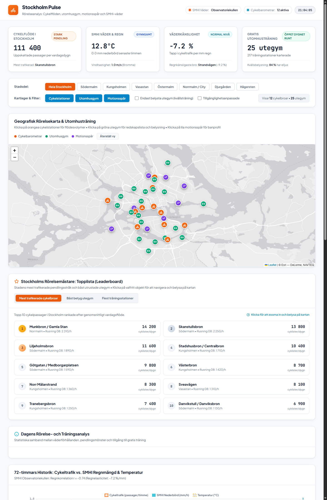

# Stockholm Pulse

En interaktiv webbapplikation och analyspanel som visar hur Stockholm rör på sig. Utforska cykelflöden över stadens viktigaste broar, hitta närmaste utegym och elljusspår, och se hur regn och temperatur från SMHI påverkar stockholmarnas resvanor.



## Vad är Stockholm Pulse?

Stockholm Pulse samlar data om stadens rörelse och utomhusaktivitet på ett och samma ställe. Här kan du snabbt se vilka cykelstråk som har mest trafik under rusningstid, hitta utegym med kvällsbelysning eller utforska klassiska motionsspår runt sjöar och genom skogar.

Appen hämtar realtidsväder från SMHI (Observatoriekullen och Bromma) och kopplar ihop väderobservationerna med historiska cykelflöden för att mäta hur mycket regn dämpar cykeltrafiken.

## Huvudfunktioner

- Interaktiv stadskarta: Se alla 12 permanenta cykelmätare, 25 kommunala utegym och populära löprundor i innerstaden och närförort.
- Topplista (Leaderboard): Utforska de 10 mest trafikerade cykelbroarna, de högst betygsatta utegymmen eller de gym som har flest träningsredskap. Klicka på valfritt objekt för att navigera och belysa det på kartan.
- Filter per stadsdel och facilitet: Filtrera snabbt fram utegym med kvällsbelysning eller tillgänglighetsanpassning för specifika stadsdelar.
- Realtidsväder från SMHI: Temperatur, nederbörd och vindhastighet hämtas automatiskt med lokal cache.
- Analysgrafer:
  - 72-timmars historik som ställer cykelflöden mot regnmängd och temperatur.
  - Dygnsrytm som visar morgon- och eftermiddagsrusning timme för timme.
  - Stadsdelsjämförelse över tillgången till gratis utomhusträning per 10 000 invånare.
- Datatabell: Detaljerade siffror för vardagsdygn, rusningstoppar och pendlingsandel för alla mätstationer.

## Teknikstack

- Backend: Python 3 med Flask
- API-integration: SMHI Meteorologiska observationer (öppet API)
- Frontend: HTML5, CSS3 (modernt skandinaviskt gränssnitt med textur och frostat glas) och vanilla JavaScript
- Kartmotor: Leaflet med stilrena kartlager från Esri Canvas World Light Gray Base
- Diagram och visualiseringar: Chart.js (lokalt paketerad)
- Testsvit: Inbyggda enhetstester via Pythons unittest-modul

## Snabbstart

### Förutsättningar

- Python 3.10 eller senare
- Git

### Installation

1. Klona projektet:
```bash
git clone https://github.com/kallt/stockholm-pulse.git
cd stockholm-pulse
```

2. Installera beroenden:
```bash
pip install -r requirements.txt
```

3. Starta applikationen:
```bash
python app.py
```

4. Öppna webbläsaren och navigera till:
```
http://127.0.0.1:5001
```

## Köra enhetstester

För att säkerställa att alla klienter, beräkningar och API-endpoints fungerar som förväntat körs testerna med:

```bash
python -m unittest tests/test_analytics.py
```

## Datakällor

- Stockholms stad Trafikkontoret: Cykelbarometrar och flödesmätningar.
- Stockholms stad Idrottsförvaltningen: Register över kommunala utegym och motionsspår.
- SMHI Open Data: Meteorologiska observationer för temperatur, nederbörd och vind.

## Licens

MIT License. Fri att använda och bygga vidare på.
